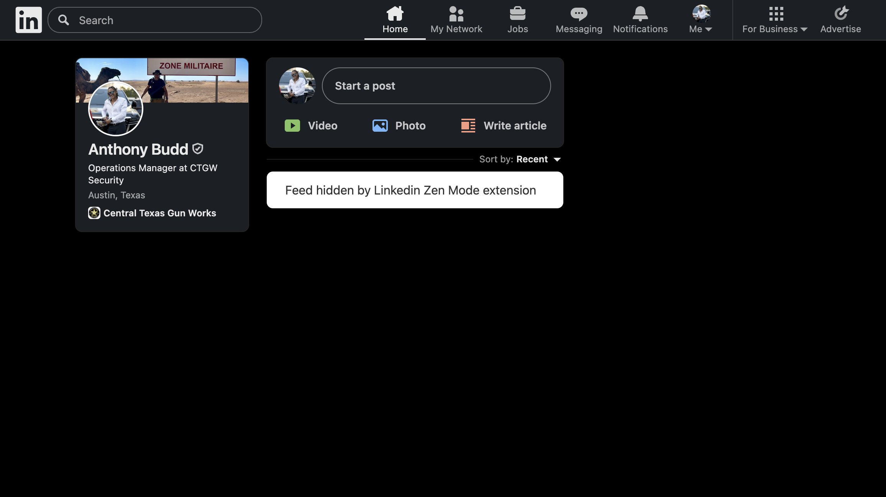

# Make Linkedin Tolerable Again

  

I'm done with all of the virtue signalling cringe posts from pages like LeaderShip First and The Female Lead so I have made a Chrome extension that entirely removes your feed and the news sidebar.

  

## Installation

1. Open Chrome and go to `chrome://extensions/`
2. Enable "Developer mode" in the top right corner
3. Click "Load unpacked" and select this folder
4. The extension will be installed and active

## Files

- `manifest.json` - Extension configuration
- `content.js` - Content script that hides the elements
- `README.md` - This file

## How it works

The extension uses a content script that:
1. Runs only on LinkedIn.com (`*://*.linkedin.com/*`)
2. Finds all elements with class `scaffold-finite-scroll` and sets `display: none`
3. Uses MutationObserver to watch for new elements being added to the page
4. Automatically hides any new elements with the `scaffold-finite-scroll` class

## Uninstalling

To remove the extension:
1. Go to `chrome://extensions/`
2. Find "LinkedIn scaffold-finite-scroll Hider" in the list
3. Click the "Remove" button

